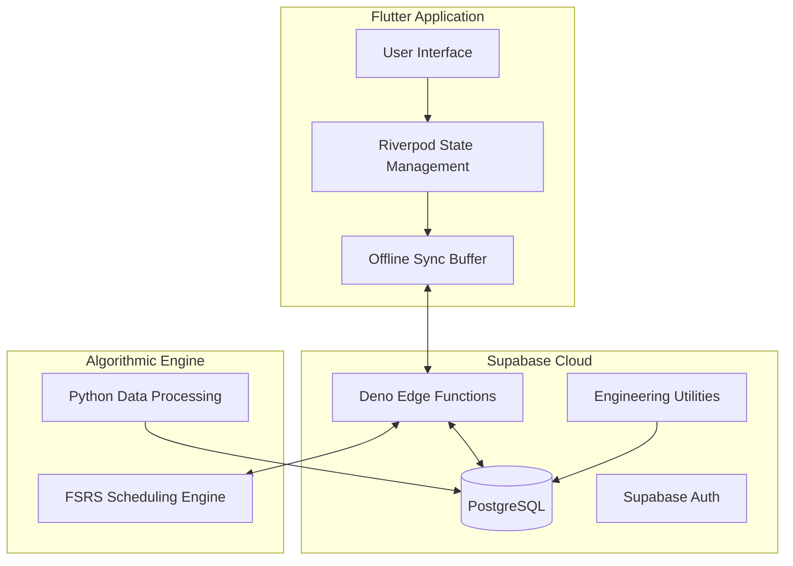

# Velang: EdTech SaaS Platform Architecture

**Note**: This repository contains the system architecture and core implementations of **Velang**.

## 🚀 Overview
Velang is a cross-platform (Mobile & Web) EdTech application optimized for German language acquisition (A0-B2). It utilizes research-backed pedagogy and the **FSRS (Free Spaced Repetition Scheduler)** algorithm to generate highly efficient, personalized learning curriculums.

**Live Production**: [**velang.app**](https://velang.app)

This repository demonstrates my role as a **System Architect and Lead Software Engineer** for the Velang project. 

## 🏗 System Architecture

The following diagram illustrates the high-level interaction between the frontend, backend, and the algorithmic engine:

## 🛠 Tech Stack
- **Frontend**: Flutter, Dart, Riverpod
- **Backend / DB**: Supabase, PostgreSQL, Edge Functions
- **Engineering / DevOps**: Python Automation and ETL
- **Data & Algorithms**: Python-based FSRS logic
- **Integrations**: SlickPay API Secure Gateway

## 🏗 My Strategic Role

### 1. Strategic AI Orchestration
As the lead orchestrator, I utilized **AI-Accelerated Development patterns** to increase development velocity. I guided advanced AI agents to build complex features (FSRS scheduling, real-time sync, secure payments) while ensuring architectural integrity, code quality, and security through continuous human-in-the-loop auditing.

### 2. System Integrity & Revenue Protection
I architected the **Financial Guarantee System**, a legally binding commitment to user progress. This involved:
- **Server-Side Target Locking**: Implementing PL/pgSQL triggers to lock daily goals at 4 AM local time, preventing client-side manipulation.
- **Anti-Gaming Filters**: Developing telemetry-based quality checks that enforce a 10-second minimum average per card to ensure genuine engagement.
- **Atomic State Machine**: Designing a deterministic user lifecycle (Active, Grace, Voided) with full audit logging.

### 3. Engineering Utility & DevOps
Beyond the consumer product, I built a suite of custom internal tools to solve infrastructure and data requirements. This includes Python-based ETL engines to handle large-scale localization and data migration.
- [`engineering/deck_migrator.py`](./engineering/deck_migrator.py): Anki-to-Supabase migration engine with regex-based curriculum parsing.
- [`engineering/localization_manager.py`](./engineering/localization_manager.py): Automation tool for merging and validating multi-language .arb files.
- [`engineering/translation_automator.py`](./engineering/translation_automator.py): Batch-processing for AI-generated translations.

### 4. Algorithmic Intelligence
I successfully integrated and optimized the FSRS algorithm within our production environment, ensuring that high-performance spaced-repetition logic is available cross-platform with sub-millisecond latency.

## 📂 Featured Code Snippets in this Repo

- [`engineering/guarantee_engine.sql`](./engineering/guarantee_engine.sql): **NEW** High-integrity SQL logic for the Financial Guarantee system.
- [`lib/providers/study_session_controller.dart`](./lib/providers/study_session_controller.dart): Demonstrates advanced Riverpod state handling and session flow.
- [`api/verify_payment.js`](./api/verify_payment.js): Secure backend integration and guarantee initialization logic.
- [`scripts/fsrs_engine.py`](./scripts/fsrs_engine.py): Implementation example of the FSRS scheduling logic in Python.
- [`engineering/translation_automator.py`](./engineering/translation_automator.py): Custom ETL tool for localization management.

---
**Lead Developer & Architect**: [abderrahmanedioubi](https://github.com/abderrahmanedioubi)
