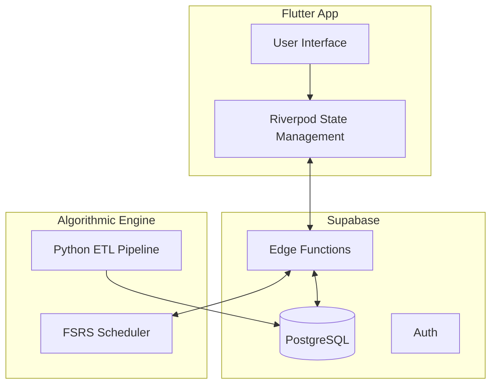

# Velang — German B2 Exam Prep Platform

> Architecture showcase for a production E-Learning SaaS. The main codebase is private.

**Live:** [velang.app](https://velang.app) · **Status:** Pre-launch (10000+ pre-registered users)

---

## What Velang Does

Cross-platform (Mobile & Web) app for German language learning (A1–B2). Users study with **6,000+ flashcards** scheduled by the **FSRS algorithm** (spaced repetition), take mock exams, and track progress across drills, listening, speaking, and writing exercises.

### Key Features
- **FSRS Scheduling Engine** — mathematically optimal review timing based on forgetting curves
- **Guarantee Tracker** — users who complete all learning milestones (curriculum, mock exams ≥70%, 90% daily consistency) qualify for exam fee refund
- **Integrated Payments** — Satim API with webhook-based verification
- **Bilingual UI** — Arabic (RTL) + English, fully localized

---

## Architecture

## Tech Stack

| Layer | Technologies |
|---|---|
| **Frontend** | Flutter, Dart, Riverpod v3 |
| **Backend** | Supabase (PostgreSQL, Edge Functions, Auth) |
| **Algorithm** | FSRS v4.2 (Python + Dart) |
| **Payments** | Satim API, Webhooks |
| **Analytics** | PostHog, A/B Testing |
| **DevOps** | Git, CI/CD |

---

## Featured Code in This Repo

### Guarantee System — [`engineering/guarantee_engine.sql`](./engineering/guarantee_engine.sql)
Server-side logic for the exam refund guarantee:
- PL/pgSQL triggers that lock daily targets at 4 AM to prevent client manipulation
- Telemetry-based quality checks (10s minimum per card)
- Deterministic state machine: `Active → Grace → Voided` with audit logging

### Study Session Controller — [`lib/providers/study_session_controller.dart`](./lib/providers/study_session_controller.dart)
Riverpod-based state management for the core study loop — handles card scheduling, answer grading, and session persistence.

### FSRS Engine — [`scripts/fsrs_engine.py`](./scripts/fsrs_engine.py)
Python implementation of spaced repetition scheduling with forgetting curve modeling.

### Payment Verification — [`api/verify_payment.js`](./api/verify_payment.js)
Supabase Edge Function for secure payment webhook processing and guarantee initialization.

### Engineering Tools
- [`engineering/deck_migrator.py`](./engineering/deck_migrator.py) — Anki-to-Supabase migration with regex-based curriculum parsing
- [`engineering/localization_manager.py`](./engineering/localization_manager.py) — Multi-language .arb file merging and validation
- [`engineering/translation_automator.py`](./engineering/translation_automator.py) — Batch AI translation processing

---

**Built by** [Abderrahmane Dioubi](https://github.com/abderrahmanedioubi)
